# Integrating new guest users to Hubspot with Logic App

## Summary

Valo created a Valo Partner Community Team where partners are invited as guest users. It utilizes [Valo Entrance](https://www.valointranet.com/valo-entrance/) for guest user handling and assigning them to a correct Azure AD security group when they sign up. We still needed an automated way to add new partners to Hubspot after they accept the invitation. Using a Logic App was chosen for this purpose.

This example can be utilized to integrate new guest users with whatever else application if it's not Hubspot for your use case. Just modify the workflow to match your needs. It might be easiest though to first copy the Logic App code as instructed below and then modify it with the designer view. The Valo Entrance is not a dependency for this Logic App, but of course, we recommend that product to handle external users.

## Azure components in the example

Here is a list of Azure components that are utilized for this workflow:

- Logic App
  - This is where the magic happens
- Key Vault
  - All sensitive values are stored here, like App Id, App Secret, Hubspot API key etc. Also it stores a secret that holds the timestamp for the last run.
- Function App
  - In this workflow, we have one helper function that is used to determine a first name and last name from a full name. Guest users rarely have the first and the last name defined and HubSpot API wants the name in that format.
  - Generally, Function Apps are very handy for any data crunching that the Logic App can't handle.
- Storage Account
  - The function app requires a storage account to work.

In addition to the components above, one Azure AD Application needs to be registered to the target tenant. It will be used to authenticate/authorize the calls to Graph API.

## The Logic App workflow

The workflow is configured to run once every day at midnight UTC time.

1. Get values from Key Vault
2. Get access token from Azure AD
3. Get guest users from Azure AD who have accepted invitation since the last run
4. If no new guest users were found, exit workflow
5. Get all members of the defined security groups
6. Exclude new guest users that are not members
7. For each new guest user
    1. If the first name is not set, call the function to try to determine it.
    2. Search Hubspot for the user
    3. Add user to Hubspot if didn't exist already
8. Update Last Run timestamp to Key Vault

## Installation

### 1. Azure AD Application

1. Add new App Registration for the Logic App.
2. Create a client secret and copy the value to your notes.

    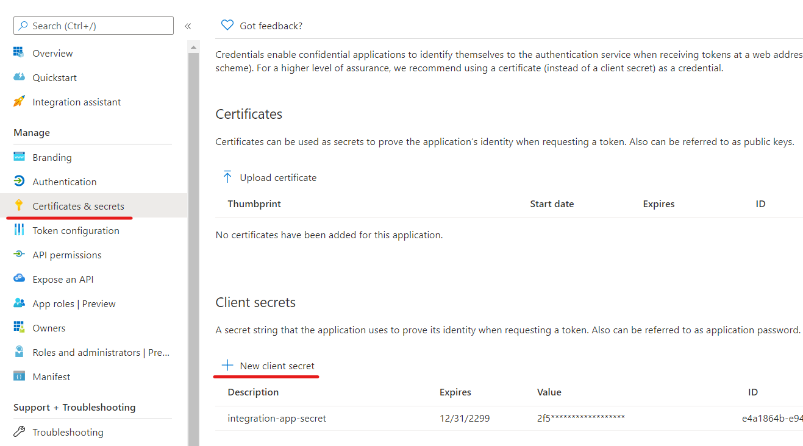

3. Add API permissions as needed. The example has these two:
    - **User.Read.All** (for getting all users from Azure AD)
    - **GroupMember.Read.All** (for reading group memberships)
    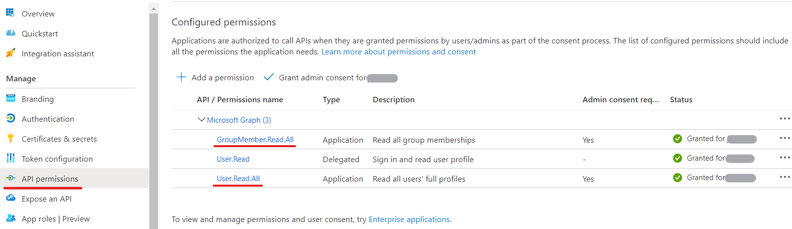
    Remember to Grant admin consent for the permissions.
4. Copy the **Application (client) ID** to your notes from the Overview page.
5. Also copy the **Directory (tenant) ID** to your notes from the same page.

### 2. Logic App

1. Create a new Logic App
2. Create a managed identity

    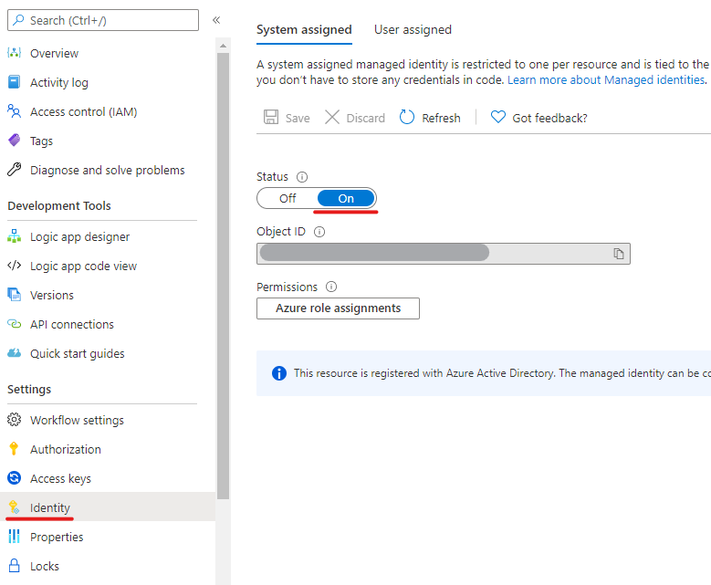

3. Copy the **Object ID** to your notes.

### 3. Key Vault

1. Create a new Key Vault
2. Add all relevant secrets. The example has these:
    - **AppId** (Client ID of the Azure AD App)
    - **AppSecret** (Client Secret of the Azure AD App)
    - **HubspotApiKey** (API Key of the Hubspot)
    - **LastRun** (Timestamp for when the last run was executed)
        - Set an initial value to a day from where you want new users to be processed. Format in ISO 8601: `2021-01-14T00:00:00Z`
    - **TenantId** (Tenant ID of the Azure AD)
    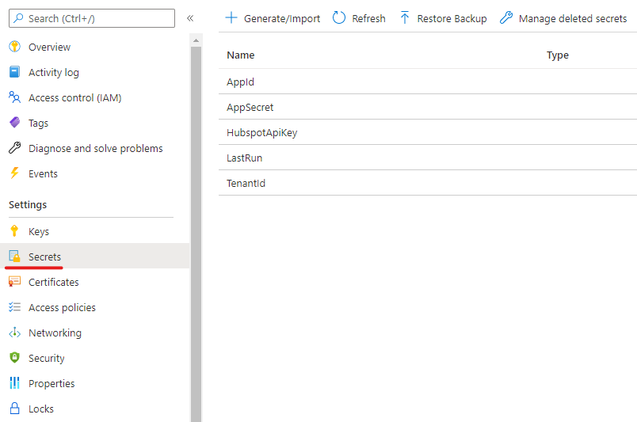
3. Add a new Access Policy that is named after your Logic App and give it **Get**, **List**, and **Set** permissions for secrets

    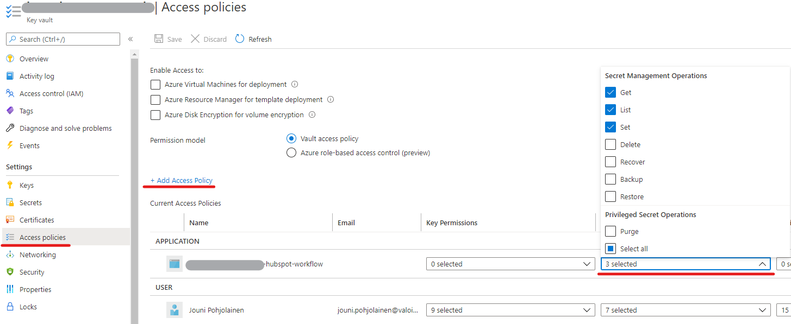

### 4. Azure Function

1. Create a Function App
2. Go to **Authentication / Authorizing**, enable authentication, and select Azure Active Directory

    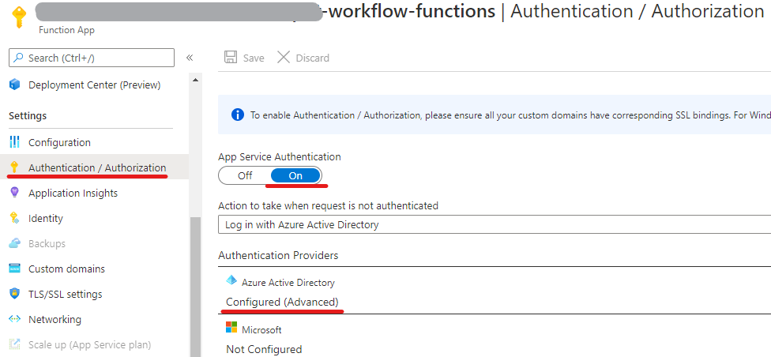

3. Configure the authentication as follows:
    - **Client ID**: Paste the *Object ID* from the Logic App managed identity here.
    - **Issuer Url**: `https://sts.windows.net/{Insert the TenantId here}`
    - **Allowed Token Audiences**: `https://management.azure.com`
    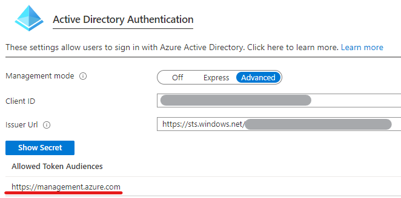
4. Deploy the example Function App by either:
    - Deploy the **ParseFullNameHttp.zip** with the instructions found in [MS Article](https://docs.microsoft.com/en-us/azure/azure-functions/deployment-zip-push).
    - Open the Visual Studio solution in the folder **PartnerOnboardingWorkflowFunctions** and publish using a publish profile found in the Functions App.
5. Go to the Properties page and copy the **Resource ID** to your notes.

    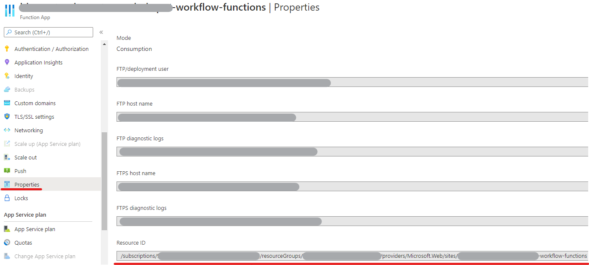

### 5. Modify the `logic-app-code.json` for your environment

1. Find a string **/functions/ParseFullNameHttp** and paste your **Resource ID** before that string.

    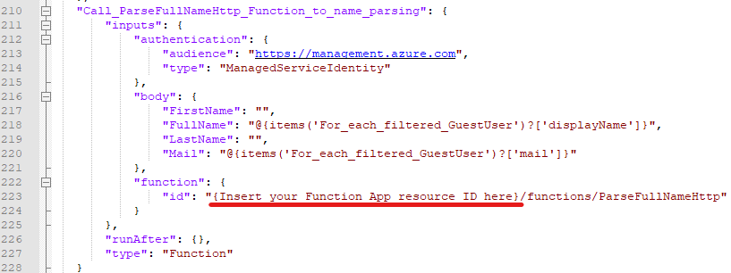

2. Find 6 instances of string **vault_name_here** and modify it to match your Key Vault URI. You can check that value from the Overview page of the Key Vault in Azure.

    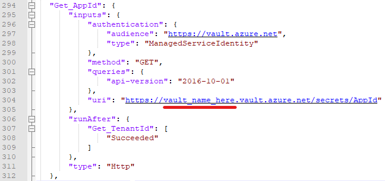

3. Find string **Initialize_GroupIds** that is an action type of InitializeVariable. Fill the value array with Group IDs to define that the new user has to be a member in one of the groups.

    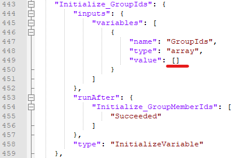

### 6. Copy the contents of `logic-app-code-json` to Logic App

1. Open the Logic App and navigate to the **code view**.
2. Copy/paste your modified logic app code to the view.

    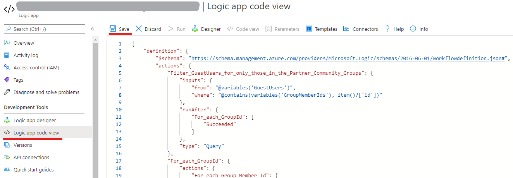

3. Click **Save** and cross your fingers that the save succeeds.
4. If the save is successful, change to the **Designer** view.
5. Make any necessary changes to the workflow depending on the use case and try to run it.

## Solution

Solution                            | Author(s)
------------------------------------|---------
guest-users-to-hubspot-integration  | [Jouni Pohjolainen](https://www.linkedin.com/in/jounipohjolainen/)

## Version history

Version | Date              | Comments
--------|-------------------|--------
1.0     | January 14, 2021  | Initial Release

## Disclaimer

**THIS CODE IS PROVIDED *AS IS* WITHOUT WARRANTY OF ANY KIND, EITHER EXPRESS OR IMPLIED, INCLUDING ANY IMPLIED WARRANTIES OF FITNESS FOR A PARTICULAR PURPOSE, MERCHANTABILITY, OR NON-INFRINGEMENT.**
